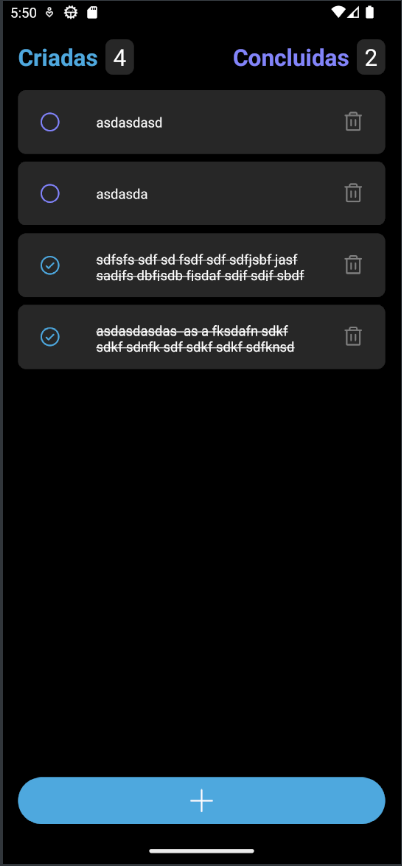

# App de Notas

Este é um pequeno e simples app de notas feito com React Native e Expo da trilha de React Native do Ignite da Rocketseat.

## Imagens

## Como executar

- Clone o repositório
- Instale as dependências com `npm i`
- Inicie o servidor com `npx expo`

Agora você pode acessar o app pelo seu celular ou emulador através do Expo.

## Funcionalidades

- Adicionar uma nova nota
- Deletar uma nota
- Marcar e desmarcar uma nota como concluída
